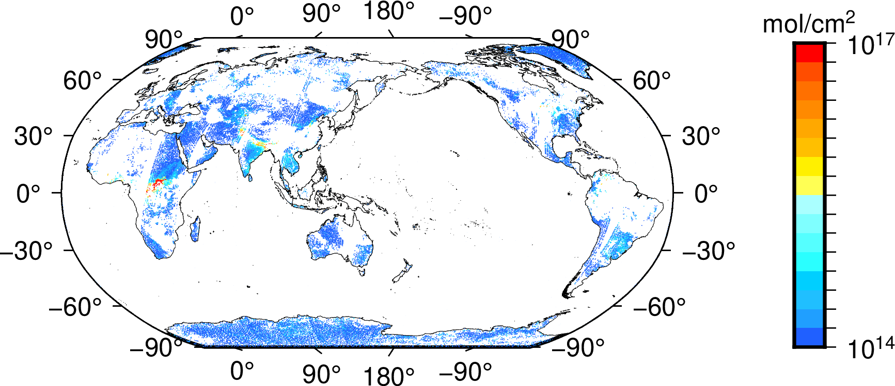

# Draw raw IASI NH3 product with GMT

## Preprocessing

```python
import xarray as xr
import pandas as pd

iasi = xr.open_dataset('nh3nn_v2_2R_20100401_AM.nc')
df = iasi.where(iasi.column > 0).where(iasi.error < 50).to_dataframe().dropna()

xyz = open('nh3.xyz','w+')
for it in df.itertuples():
  lon = getattr(it, 'longitude')
  lat = getattr(it, 'latitude')
  data = getattr(it, 'column')
  xyz.write(f'{lon:f} {lat:f} {data:f}\n')
xyz.close()
```

## Draw

```bash
gmt begin nh3 png
gmt makecpt -Cno_green -T1e14/1e17 -Z
gmt plot -R-180/180/-90/90 -JN150/10c -By30 -Bx90 -C -Sc0.01 -I+ nh3.xyz
gmt coast -Swhite -Dl -W1/0.1
gmt colorbar -C -Dx12c/0c+w5c/0.5c -By+l"mol/cm@+2@+" -S -L -Q
gmt end
```

In `colorbar`, `-Q` is used to generate logarithmic ticks.  

## Result


